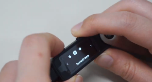
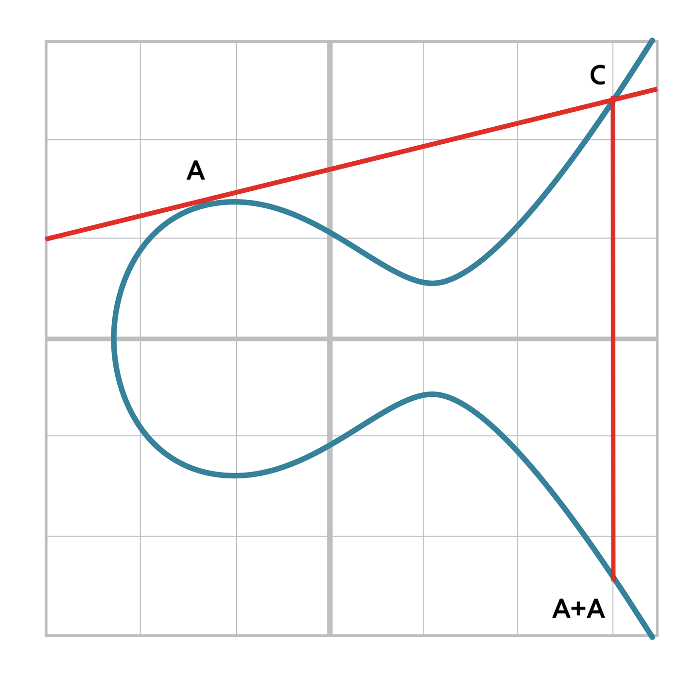

# ECDSA

> 📖 원문: [Programming Bitcoin ch01](https://github.com/jimmysong/programmingbitcoin/blob/master/ch01.asciidoc)  
> 　　　　[Programming Bitcoin ch02](https://github.com/jimmysong/programmingbitcoin/blob/master/ch02.asciidoc)  
> 　　　　[Programming Bitcoin ch03](https://github.com/jimmysong/programmingbitcoin/blob/master/ch03.asciidoc)

---

목차
- [ECDSA](#ecdsa)
  - [ECDSA(Elliptic Curve Digital Signature Algorithm)란?](#ecdsaelliptic-curve-digital-signature-algorithm란)
  - [비트코인에서 서명 생성과 서명 검증은 언제 일어날까요?](#비트코인에서-서명-생성과-서명-검증은-언제-일어날까요)
  - [ECDSA의 토대가 되는 타원곡선 암호(ECC)에 대해 알아봅니다.](#ecdsa의-토대가-되는-타원곡선-암호ecc에-대해-알아봅니다)
    - [왜 타원곡선 암호를 사용할까요?](#왜-타원곡선-암호를-사용할까요)
    - [비트코인에서 사용하는 타원곡선 암호 이해하기](#비트코인에서-사용하는-타원곡선-암호-이해하기)
  - [비트코인에서 사용하는 타원곡선](#비트코인에서-사용하는-타원곡선)
  - [비트코인의 공개키 암호 기법](#비트코인의-공개키-암호-기법)
  - [비트코인의 ECDSA](#비트코인의-ecdsa)
    - [서명 검증](#서명-검증)
    - [서명 생성](#서명-생성)

---
 

## ECDSA(Elliptic Curve Digital Signature Algorithm)란?

타원곡선을 활용하여 디지털 서명을 하는 알고리즘입니다. 비트코인의 핵심인 전자서명과 서명 검증에 사용되는 알고리즘입니다.

> 💡 생소한 단어들에 당황하지 마세요! 저희가 중학교 때 배웠던 ‘방정식’이랑 비슷합니다. 다만 익숙하지 않아서 더 어렵게 느껴지는 것일 뿐입니다! 여러분은 나라에서 정한 교과과정에 맞춰 도형방정식을 배웠을 뿐, 그 중요성에 따라 다음 세대 교과과정에는 도형방정식 대신 타원곡선이 포함될지도 모릅니다.

 

## 비트코인에서 서명 생성과 서명 검증은 언제 일어날까요?

- 서명 생성: 여러분이 지갑을 통해 새로운 트랜잭션을 생성하고 전송하기 전에 여러분의 개인키로 서명하는 단계입니다.
  
- 서명 검증: 서명한 트랜잭션을 비트코인 네트워크에 브로드캐스팅한 후에, 비트코인 노드 또는 사용자가 서명이 유효한지 확인합니다. 이를 통해 트랜잭션을 위조하거나 변조하는 것을 방지하고 블록체인의 무결성을 유지할 수 있습니다.  
  
   
## ECDSA의 토대가 되는 타원곡선 암호([ECC](https://ko.wikipedia.org/wiki/%ED%83%80%EC%9B%90%EA%B3%A1%EC%84%A0_%EC%95%94%ED%98%B8))에 대해 알아봅니다.

### 왜 타원곡선 암호를 사용할까요?

비트코인 지갑을 관리할 때 개인키를 절대 유출해서는 안된다는 것을 아실겁니다. 하지만 개인키로부터 타원곡선 암호를 통해 얻어진 공개키는 다른 사람에게 공개해도 괜찮죠. 그 이유는 역으로 연산하여 공개키로부터 개인키를 얻어내는 것은 것은 불가능 하고, 원하는 값이 나올때까지 하나씩 연산해 보는 시도는 여러분의 1억 세대에 걸쳐서 시도해도 달성하지 못할 수도 있는 일이기 때문입니다. **이런 특성을 띄는 방정식을 비대칭 방정식이라고 하며 비트코인의 비대칭키 암호 기법(개인키/공개키 생성하는 기법)으로 사용되는 이유입니다.**

타원곡선 암호 연산을 아래와 같이 간단한 수식으로 표현해 보았습니다.

- e: 개인키
- P: 공개키
- G: 타원 곡선 위의 정해진 한 점(생성점, Generator point 혹은 point of origin)

개인키과 G를 알고 있을 때 정해진 연산을 거쳐 공개키를 알아내는 연산은 아래와 같이 표현해 보았습니다.

$$
e・G = P
$$

공개키와 G를 알고 있을 때, 역으로 연산하여 개인키를 알아내는 연산은 아래와 같이 표현해 보았습니다.

$$
P/G = e
$$

(단순하게 곱셈과 나눗셈 연산으로 표현한 것일 뿐, 우리가 알고 있는 일반적인 곱셈, 나눗셈이 아닙니다.)

다시 한번 정리하면, e와 G를 알고 있을 때 P를 알아내는 것은 가능하지만 P와 G를 알고 있다고 해서 e를 알아내는 것은 불가능에 가깝습니다.

### 비트코인에서 사용하는 타원곡선 암호 이해하기

도대체 어떤 알고리즘이길래 이렇게 뛰어난 비대칭성을 띄는 걸까요?

비트코인에서 사용하는 타원곡선 암호를 이해하기 위해서 다음 개념들을 이해해야 합니다.
  
   

**1) 유한체(Finite Field)와 나머지 연산(Modulo Arithmetic)**

여기 11개의 원소를 가지는 유한체가 있습니다. 유한체 원소의 개수를 나타내는 값을 ‘위수(order)’라고 합니다. 필요한 조건을 충족하는 유한체는 소수나 소수의 거듭 제곱만을 위수로 갖습니다. 아래 유한체는 위수가 11인 유한체 이며 0부터 10까지 정수를 원소로 갖습니다.

$$
F_{11} = \{0,1,2,3,4,5,6,7,8,9,10\}
$$

유한체는 다음 5가지 성질을 만족해야 합니다.

1. a와 b가 집합에 속해 있으면 a+b, a∙b도 집합 안에 있다. (집합 위에 두 연산 +,∙ 이 닫혀 있음)
2. 집합에 0으로 표기하는 원소가 존재하고 집합 내 다른 원소 a와 + 연산 결과는 a다. 즉 a+0=a (+ 연산에 대한 항등원 존재)
3. 집합에 1로 표기하는 원소가 존재하고 집합 내 다른 원소 a와 ∙연산 결과는 a다. 즉 a∙1=a (∙연산에 대한 항등원 존재)
4. 집합의 원소 a와 + 연산 결과가 0이 되게 하는 원소 b가 역시 집합에 속해 있고 이러한 b를 -a로 표기한다. (+ 연산에 대한 a의 역원 -a 존재).
5. 0이 아닌 집합의 원소 a에 대해 a∙b=1이 되게 하는 원소 b가 역시 집합에 속해 있고 이러한 b를 $a^{-1}$로 표기한다. (∙연산에 대한 a의 역원 $a^{-1}$ 존재).

우리가 일반적으로 아는 덧셈 연산과 곱셈 연산을 수행했을 때 1번 성질부터 만족하지 않는다는 것을 알 수 있습니다. 9+10이 결과 19인데 $F_{11}$에 존재하지 않고, 3∙5의 결과인 15도 마찬가지로 존재하지 않습니다.

따라서 위 성질을 모두 만족하는 유한체를 정의하기 위해 덧셈과 곱셈 연산을 재정의합니다. 이 때 사용하는 연산이 나머지 연산입니다. 초등학교 때 처음 나눗셈을 배울 때 완전히 나누어떨어지지 않는 경우 ‘나머지’가 발생합니다. 나머지 연산은 이 나머지 값을 구하는 연산이고 연산자는 %를 사용합니다.

나머지 연산으로 새롭게 정의한 덧셈과 곱셈을 해보겠습니다. 새롭게 정의한 연산임을 표시하기 위해 연산자 기호의 아래첨자로 f를 추가하였습니다.

$$
9+_f10=(9+10) \% 11=8
$$

$$
3 ・_f 5=(3 ・ 5)\%11=4
$$

결과값이 모두 $F_{11}$에 존재하게 되었습니다. 이렇게 나머지 연산으로 새로운 덧셈과 곱셈을 정의하였고 뺄셈과 나눗셈도 나머지 연산으로 재정의 하면 위 5가지 유한체의 조건을 모두 만족하게 됩니다. (더 상세한 설명은 [Programming Bitcoin의 1장을 참고하세요.](https://github.com/jimmysong/programmingbitcoin/blob/master/ch01.asciidoc))
  
   

**2) 타원 곡선에서의 점 덧셈**

타원 곡선은 중학교 수학 시간에 본 방정식과 유사합니다.

$$
y^2 = x^3 + ax + b

$$

우리는 이 타원곡선에서 두 점의 덧셈에 대해 알아볼 필요가 있습니다. 이번에도 우리가 일반적으로 알고 있는 덧셈은 잠시 잊고 타원 곡선에서의 점 덧셈(Point Addition)을 정의해봅니다. “타원곡선에서 점 덧셈은 두 점 A와 B를 지나는 직선이 타원과 만나는 교점을 x축으로 대칭시킨 점을 A+B로 정의합니다.” 위 그림에서 볼 수 있듯이, 곡선 위의 점 A와 B를 연결한 직선은 곡선의 다른 한 점 C에서 만나게 되고 C를 x축으로 대칭시킨 점이 A+B의 결과입니다.

점 덧셈 하려는 타원곡선위 두 점이 다를 때의 점 덧셈 공식은 다음과 같습니다. (s는 기울기)

자세한 유도 과정은 [여기](https://github.com/jimmysong/programmingbitcoin/blob/master/ch02.asciidoc)를 참고하세요.

$$
s=(y_2-y_1)/(x_2-x_1)
$$

$$
x_3 = s^2-x_1-x_2
$$

$$
y_3 = s(x_1-x_3)-y_1
$$

만약 점 A와 B가 같은 점인 경우는 어떻게 될까요?

타원곡선 위의 점 A에서의 탄젠트 값을 기울기로 가지고 점 A를 지나는 직선과 교차하는 타원곡선 위의 또 다른 점 C를 x축으로 대칭시킨 것이 점 덧셈의 결과가 됩니다.

점 덧셈 하려는 타원곡선위 두 점이 같을 때의 점 덧셈 공식은 다음과 같습니다. (s는 기울기)

$$
s=(3x_1^2+a)/2y_1
$$

$$
x_3 = s^2-2x_1
$$

$$
y_3 = s(x_1-x_3)-y_1
$$
  
   
  
**3) 유한체에서 정의된 타원곡선**

지금까지 우리는 유한체와 실수체(여러분이 아는 실수) 위 타원곡선에서의 점 덧셈을 살펴봤습니다. 이번에는 유한체 위에서의 타원곡선 방정식과 그 위에서의 점 덧셈 연산을 소개합니다.

출처: [https://github.com/jimmysong/programmingbitcoin/blob/master/ch03.asciidoc#elliptic-curves-over-finite-fields](https://github.com/jimmysong/programmingbitcoin/blob/master/ch03.asciidoc#elliptic-curves-over-finite-fields)

위 그래프는 유한체 $F_{103}$에서 정의된 타원곡선 방정식 $y^2=x^3+7$의 그래프입니다. 먼저 점 (17, 64)가 곡선 위에 있는지 보기 위해 양변에 좌표값을 대입하면 다음과 같습니다. (앞으로 유한체에서의 모든 연산은 앞서 배운 나머지연산을 사용합니다.)

$$
y^2 = 64^2 \% 103 = 79
$$

$$
x^3+7= (17^3+7)\%103 = 79
$$

**유한체에서 정의되었기 때문에 타원곡선의 모양은 실수체에서 정의된 것과 많이 다릅니다. 점들이 완전히 흩어져 있는 비선형 연산이고 결과들은 무작위 값처럼 보여 예측이 힘들다는 것을 알 수 있습니다. 유일하게 관찰할 수 있는 패턴은 y축의 중간값(100)을 지나는 수평축을 기준으로 대칭이라는 점입니다. 실수체에서의 타원곡선처럼 x축으로 대칭도 아닙니다. 왜냐하면 유한체에는 음수가 없기 때문입니다.** 놀라운 사실은 유한체에서 정의된 덧셈, 뺄셈, 곱셈, 나눗셈, 거듭제곱의 각종 연산을 그대로 점 덧셈 방정식에 사용할 수 있다는 것입니다.

따라서 유한체의 타원곡선에서 점 덧셈을 할 때 위에서 정의했던 점 덧셈 공식을 그대로 사용합니다. (단 모든 사칙연산은 나머지연산을 활용)

다음은 위수가 223인 유한체 $F_{223}$에 대한 타원 곡선 $y^2=x^3+7$위의 점 A(170,142)에서 A를 총 40번 점 덧셈 한 연산 결과를 표시한 그래프입니다.

출처: [https://github.com/jimmysong/programmingbitcoin/blob/master/ch03.asciidoc#scalar-multiplication-for-elliptic-curves](https://github.com/jimmysong/programmingbitcoin/blob/master/ch03.asciidoc#scalar-multiplication-for-elliptic-curves)

1번 점은 A(170, 142)이고 2번 점은 A+A의 결과, 3번 점은 A+A+A의 결과입니다. 여러분은 위 그래프에서 점 덧셈을 한 결과 좌푯값이 어떤 x, y값을 가질 지 예측하실 수 있나요?

보시다시피 y축의 중간값을 지나는 수평축을 기준으로 대칭이라는 점 외에는 규칙을 찾을 수 없기 때문에 예측하기 매우 힘드실 겁니다.

우리는 이제 비트코인에서 이러한 특징을 활용하여 개인키, 공개키를 구체적으로 어떻게 생성하는지 직접 마주하게 됩니다. 이 과정을 소개하기 위해서 스칼라 곱셈과 유한순환군 개념을 소개합니다.

**스칼라 곱셈이란?**

스칼라 곱셈은 한 점을 수회 반복해서 더하는 연산입니다.

처음의 A점을 시작으로 N번의 점 덧셈 연산을 할 수 있습니다.

$$
A+A+A+A+...+A
$$

타원곡선에서의 점 덧셈은 결합 법칙이 성립합니다. 즉 (A+A)+A = A+(A+A)를 만족하기 때문에 점 앞에 스칼라값을 곱하는 스칼라 곱셈으로 N번의 점 덧셈 연산을 표현할 수 있습니다.

$$
N・A
$$

따라서 스칼라 곱셈 결과를 구하는 것은 정해진 연산을 하면 되므로 어려울 것이 없지만 그 반대의 계산, 점 나눗셈은 매우 어렵습니다. 예를 들어서, $F_{223}$ 위의 점 (47,71)에 20 스칼라 곱 결과를 구할 때,

$$
20・(47,71) = (47, 152)
$$

20번의 점 덧셈으로 결과를 구할 수 있지만, (47, 71) 점에서 몇번의 점 덧셈을 해야 (47, 152)이라는 결과를 얻을 수 있는지를 알아내려면 1부터 20까지 다 해보면서 확인하는 수밖에 없습니다.

**유한순환군(Finite Cyclic Group)**

지금까지 스칼라 곱셈과 이 곱셈이 비대칭 연산이라는 점을 알아보았습니다. 주목해야 할 스칼라 곱셈의 또 다른 성질은 어떤 점에 스칼라 값을 계속 증가시키면서 곱하다 보면 무한원점(the point at infinity)에 도달한다는 것입니다. 무한원점은 덧셈에 대한 항등원(0)입니다. 만약 어떤 점 G에 스칼라 곱을 무한원점(0)에 도달할 때까지 반복한다면 다음 집합을 얻을 수 있습니다.

$$
\{G, 2G, 3G, 4G, ... nG\}
$$

여기서 nG=0

이 집합을 수학용어로 군(group)이라고 합니다. n은 유한한 특정 값이기에 유한군, 구체적으로는 유한순환군이라고 부르며 이 유한순환군에서의 덧셈 연산을 타원 곡선 암호에 활용합니다.

$$
aG+bG = (a+b)G
$$

그리고 nG=0이 되게 하는 n값을 ‘**군의 위수**(the order of the group)’라고 합니다.
  
   
    
   
  
## 비트코인에서 사용하는 타원곡선

지금까지 유한체와 타원 곡선 그리고 유한체 위에서의 타원 곡선에서 점 덧셈 연산을 계속 했을 때 무한 원점에 도달하게 하는 스칼라 값을 군의 위수라고 부르며 그 과정을 통해 얻은 집합을 유한순환군이라고 한다는 것을 배웠습니다. 유한체 위에서 타원 곡선을 활용하는 이유는 유한체와 나머지 연산을 활용하면 다른 수 체계에서 발생할 수 있는 오류를 예방할 수 있기 때문입니다. 또 유한체 상에서 작동하는 타원 곡선 암호의 연산은 비교적 빠르고, 작은 크기(32byte)의 공개키와 개인키를 생성할 수 있습니다. 이는 효율적인 트랜잭션 처리와 더불어 비트코인 시스템 전반의 성능 향상을 이끌어냅니다.

암호학에서 어떤 위수를 가지는 유한체와 어떤 타원 곡선을 사용할지, 점 덧셈 연산을 시작할 시작점(생성점)은 어딘지 등 다양하게 설정할 수 있습니다.

- 곡선 $y^2 = x^3 + ax + b$에서 *a*와 _b_
- 유한체의 위수인 소수 _p_
- 생성점 *G*의 *x*와 _y_ 좌푯값
- *G*로 생성한 군의 위수 _n_

비트코인은 보안과 편의성 사이의 적당한 절충점을 찾은 secp256k1이라 불리는 곡선을 사용합니다. secp256k1의 매개변수는 다음과 같습니다.

- a=0, b=7로 곡선은 $y^2 = x^3 + 7$
- *p* = $2^{256}$ – $2^{32}$ – 977
- *Gx* =0x79be667ef9dcbbac55a06295ce870b07029bfcdb2dce28d959f2815b16f81798
- *Gy* =0x483ada7726a3c4655da4fbfc0e1108a8fd17b448a68554199c47d08ffb10d4b8
- *n* = 0xfffffffffffffffffffffffffffffffebaaedce6af48a03bbfd25e8cd0364141

이 곡선의 특징은 다음과 같습니다.

1. a가 0이고 b가 7로 방정식이 상대적으로 간단합니다.

2. 유한체의 위수인 p가 $2^{256}$에 매우 가까운 값입니다. 즉 $2^{256}$보다 작은 대부분의 숫자가 유한체를 형성하게 됩니다. 따라서 군에 속하는 곡선 위 점은 각각 256 비트로 표현되는 (x, y) 좌푯값을 가지게 됩니다.

3. 군의 위수인 n도 $2^{256}$에 매우 가까운 값입니다. 따라서 스칼라 곱셈에서 스칼라 값 또한 256비트로 표현할 수 있습니다.

4. $2^{256}$은 엄청나게 큰 숫자이지만 이보다 작은 값들은 놀랍게도 32바이트로 저장될 수 있습니다. 즉 비밀키를 비교적 적은 공간으로 저장할 수 있습니다.

> 💡 $2^{256}$은 약 $10^{77}$로 표현할 수 있을만큼 큰 숫자이며, 지구상의 원자의 수가 약 $10^{55}$이고, $10^{-12}$초에 1조번 계산하는 $10^{12}$개의 컴퓨터가 천억 년 동안 수행하는 총 계산량이 $10^{55}$미만이라는 것을 안다면 우리가 생각하는 것보다 훨씬 더 엄청나게 큰 수라는 것을 알 수 있습니다.
  
   
    
   
  
## 비트코인의 공개키 암호 기법

> 💡 공개키 암호 기법이란? 개인키, 공개키 쌍을 활용하는 비대칭키 암호의 다른 말입니다.

다시 한번 우리가 왜 비트코인의 개인키를 지켜야 하고, 개인키로부터 공개키가 어떻게 연산되는지 지금까지 배운 것을 통해 짚어보겠습니다.

$$
e・G = P
$$

- e: 개인키
- P: 공개키
- G: 타원 곡선 위의 정해진 한 점(생성점(Generator point, 혹은 point of origin)

본문의 첫부분에 보여드린 간단한 수식입니다. G는 $y^2 = x^3 + 7$ 위의 한 점이자 연산의 시작점인 생성점입니다.

- *Gx* =0x79be667ef9dcbbac55a06295ce870b07029bfcdb2dce28d959f2815b16f81798
- *Gy* =0x483ada7726a3c4655da4fbfc0e1108a8fd17b448a68554199c47d08ffb10d4b8
- *n* = 0xfffffffffffffffffffffffffffffffebaaedce6af48a03bbfd25e8cd0364141

e는 n이하의 정수이며 생성점 G에서 점 덧셈 연산을 e번 한 결과가 공개키 P이고 P 역시 $y^2 = x^3 + 7$ 위의 한 점이므로 (x, y) 좌푯값입니다.

n은 $2^{256}$에 매우 가까운 값으로 개인키 e는 이 엄청난 범위의 정수들 중 1개의 값을 가지게 됩니다. 타원 곡선에서의 점 덧셈의 비대칭성으로 P와 G를 안다고 해서 e를 역연산으로 계산하는 것이 불가능합니다. 따라서 저희가 100비트코인이 들어있는 지갑 주소를 알고, 이 지갑의 개인키를 알아내려고 시도하기 위해 $10^{-12}$초에 1조번 계산하는 컴퓨터 100개를 마련했다고 가정했을 때 개인키가 0부터 n 중 어떤 값인지 알아내기 위해 점 덧셈 연산을 시작한다면 알아내는 데 까지 $10^{21}$년이 넘게 걸릴 수도 있습니다.

이러한 확률적 이유로 우리가 매우 예측하기 힘든 값을 개인키로 사용했을 때 안전하게 비트코인을 보관할 수 있는 것입니다.
  
   
  
## 비트코인의 ECDSA

지금까지 비트코인의 개인키와 공개키 생성 과정에서 타원곡선 암호가 어떻게 사용되었는지 설명드렸다면 지금부터는 ECDSA의 트랜잭션 서명 과정과, 비트코인 노드들이 서명을 검증하는 과정을 더 자세히 알아보도록 하겠습니다. 어려워 보이는 수식들이 등장하지만, “A라는 사람이 자신이 소유하고 있는 비트코인을 B에게 전송하는 것이 맞다” 라는 사실을 안전하게 증명하기 위한 과정이라는 것에 집중하시면 되겠습니다.
  
   
  
### 서명 검증

우선 “A가 B에게 0.1BTC를 주겠다”라는 트랜잭션에 서명 후 브로드캐스팅을 했고, 비트코인 노드가 이 트랜잭션을 검증하는 과정부터 살펴보겠습니다.

여러분이 검증해야 하는 노드라면 다음과 같은 정보를 받게 됩니다.

P = (0x887387e452b8eacc4acfde10d9aaf7f6d9a0f975aabb10d006e4da568744d06c, 0x61de6d95231cd89026e286df3b6ae4a894a3378e393e93a0f45b666329a0ae34)

z = 0xec208baa0fc1c19f708a9ca96fdeff3ac3f230bb4a7ba4aede4942ad003c0f60

r = 0xac8d1c87e51d0d441be8b3dd5b05c8795b48875dffe00b7ffcfac23010d3a395

s = 0x68342ceff8935ededd102dd876ffd6ba72d6a427a3edb13d26eb0781cb423c4

P는 A의 공개키입니다. (공개키는 타원곡선의 한 점으로 x,y 좌푯값임을 잊지 마세요.)

z는 서명해시(Signature Hash)입니다. 서명해시는 A가 B에게 0.1BTC를 전송하겠다는 데이터를 SHA-1 해시함수로 두번 해시한 결과입니다.

r은 타원곡선 위의 한 점 R의 x좌표입니다. 갑자기 R이 왜 튀어나왔냐면, 만약 A가 트랜잭션을 전송할 때마다 별도의 장치 없이 자신의 개인키로 트랜잭션 데이터를 암호화해서 보낼 경우 ‘이중 지불 공격’의 위험이 생기기 때문입니다. 이를 방지하기 위해 서명을 생성할 때 마다 새로운 임의의 값 k를 랜덤하게 만들고, 이것을 군의 위수로 활용합니다. 비트코인의 공개키 암호 기법과 똑같은 타원곡선 암호 기법을 사용하고 생성점 G를 시작으로 k번의 점 덧셈 연산의 결과인 점 R의 x좌표 r을 사용합니다.

$$
k・G = R
$$

s는 $(z+re)/k$ 를 연산한 값입니다. (e는 개인키)

여러분은 검증해야 하는 노드이므로 e와 k값을 알지 못한 상태에서 주어진 4개의 값을 이용하여 A가 생성한 트랜잭션이 맞는지 다음 식을 통해 검증하면 됩니다.

1. u = z/s, v = r/s
2. uG + vP = R을 계산합니다.

2번 결과로 얻어진 R의 x좌표가 r과 같다면 서명은 유효합니다.
  
   
  
### 서명 생성

다음은 A가 서명을 생성하는 과정입니다.

1. 서명해시 z를 생성합니다.
2. 임의의 값 k를 선택합니다.
3. kG = R을 계산하여 R의 x좌표값의 r을 얻습니다.
4. s = (z+re)/k를 계산합니다.
5. 서명 검증에 사용할 (r, s)쌍, 서명해시 z, 공개키 P를 브로드캐스팅 합니다.

> 💡 R = kG로부터 s = (z+re)/k를 유도한 과정과 검증 과정에 대해 더 자세히 알고 싶으신 분은 [여기](https://github.com/jimmysong/programmingbitcoin/blob/master/ch03.asciidoc#signing-and-verification)를 참고하세요.

지금까지 서명 검증과 생성 과정에 대해 소개했습니다. ECDSA를 통해 메시지 서명으로 비밀키 소유를 증명할 수 있고, 비밀키를 가진 사람이 메시지에 서명했다는 것을 검증할 수 있게 되었습니다.
